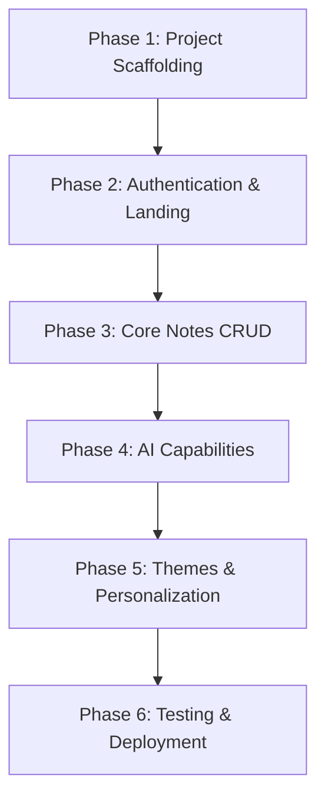

# QuillInsight Project Roadmap

This roadmap outlines the phases, checklists, and milestones for building **QuillInsight**, an AI-powered note-taking application. Use this document to track implementation status and project progress.

---

## 🗺️ Project Phases at a Glance

---

## 🛠️ Detailed Phase Breakdown & Checklists

### Phase 1: Environment & Project Scaffolding
Set up the core project foundation, dependencies, and Supabase database client configuration.

- [x] **1.1 Dependencies Installation**
  - Install `@supabase/supabase-js` and `@supabase/ssr` (for Next.js App Router).
  - Install client icons (e.g., `lucide-react`) and style utilities.
  - Install OpenAI SDK client.
- [x] **1.2 Supabase Schema Scaffolding**
  - Create `profiles` table linked to Supabase Auth.
  - Create `folders` table (id, user_id, name, created_at).
  - Create `notes` table (id, user_id, folder_id, title, content, summary, tags, highlights, created_at, updated_at).
  - Define PostgreSQL Row-Level Security (RLS) policies to isolate user data.
- [x] **1.3 Environment Configuration**
  - Set up local `.env.local` for Supabase URL, Anon Key, Service Role Key, and OpenAI API Key.
- [x] **1.4 Global Theme & Typography Foundation**
  - Define CSS custom properties (variables) in `src/app/globals.css` matching the color palette.
  - Configure Tailwind CSS v4 support for the custom themes.

---

### Phase 2: Landing Page & Authentication
Develop the welcoming entrance, user login flows, and the interactive anonymous guest sandbox.

- [x] **2.1 Public Landing Page**
  - Build a sleek, modern landing page illustrating value propositions, AI features, and visuals.
  - Apply clean transitions, dynamic hover states, and brand colors.
- [x] **2.2 Auth Integration (Supabase Auth)**
  - Build Sign Up, Sign In, and Password Reset screens/modals.
  - Implement Next.js Middleware/Proxy to handle auth sessions and protect dashboard routes.
- [x] **2.3 Anonymous Visitor Sandbox**
  - Build a mini-playground note editor on the landing page.
  - Implement a client-side or transient API-powered note summarization demo.
  - Show a prominent CTA to register/login to save notes.

---

### Phase 3: Dashboard & Core Notes Management
Build the main dashboard workspace where users organize, write, and manage their notes.

- [x] **3.1 Layout & Sidebar Navigation**
  - Responsive layout with collapsible sidebar.
  - Navigation tree for folders, list of tags, settings, and profile details.
- [x] **3.2 Folders & Tags CRUD**
  - Create, rename, and delete folders.
  - Inline tag management and filtering by tags.
- [x] **3.3 Notes Workspace & Editor**
  - Rich text or markdown note editor with auto-save capability.
  - Note list with search input, sorting options (date modified, title), and filters.
  - Action buttons to delete, move to folder, or clone notes.

---

### Phase 4: AI Capabilities Integration
Implement the OpenAI-driven capabilities that summarize, tag, and highlight notes.

- [x] **4.1 Next.js AI API Routes**
  - Create secure server-side API endpoint (`/api/ai/analyze`) with prompt guidelines.
  - Restrict access to authenticated sessions.
- [x] **4.2 AI Insight Panels**
  - Implement a collapsible side-drawer or tabbed panel in the editor to showcase AI results.
  - **Auto-Summarize:** Displays a concise summary of the note text.
  - **Auto-Tagging:** Lists AI-suggested tags with buttons to instantly add them to the note.
  - **Highlights Panel:** Extracts bullet points, tasks, or key takeaways.
- [x] **4.3 Toggle Raw/Enhanced View**
  - User toggle to display the raw note text or a formatted, AI-enhanced reader view.

---

### Phase 5: Personalization & Custom Themes
Add customizable visuals and dashboard options.

- [ ] **5.1 Multi-Theme Engine**
  - Configure class-based theme switcher applying global CSS variables.
  - Support the 5 specified dashboard themes:
    1. **Classic Light** (F8FAFC / 0F172A / 3B82F6)
    2. **Professional Dark** (0F172A / F8FAFC / 3B82F6)
    3. **Modern Purple** (1E1B4B / EDE9FE / 8B5CF6)
    4. **Eco Green** (ECFDF5 / 064E3B / 22C55E)
    5. **Minimal Gray** (F1F5F9 / 1E293B / 3B82F6)
- [ ] **5.2 Settings Panel**
  - Account info, security actions.
  - Personalization section to toggle dashboard themes (preview and apply instantly).
  - Persistent user preference saved in profile metadata.

---

### Phase 6: Testing, Polish & Deployment
Verify functionality, optimize UX, and launch the web app.

- [ ] **6.1 Component & Integration Testing**
  - Write test cases for note management, filters, and theme application.
  - Add edge case test coverage (very long notes, empty inputs, network errors).
- [ ] **6.2 Animations & Micro-interactions**
  - Add loading skeletons for dashboard states.
  - Implement smooth entry animations and hover effects on buttons/cards.
- [ ] **6.3 Deployment**
  - Deploy frontend to Vercel.
  - Bind environment variables and database tables in the Supabase production environment.
  - Final end-to-end check.
